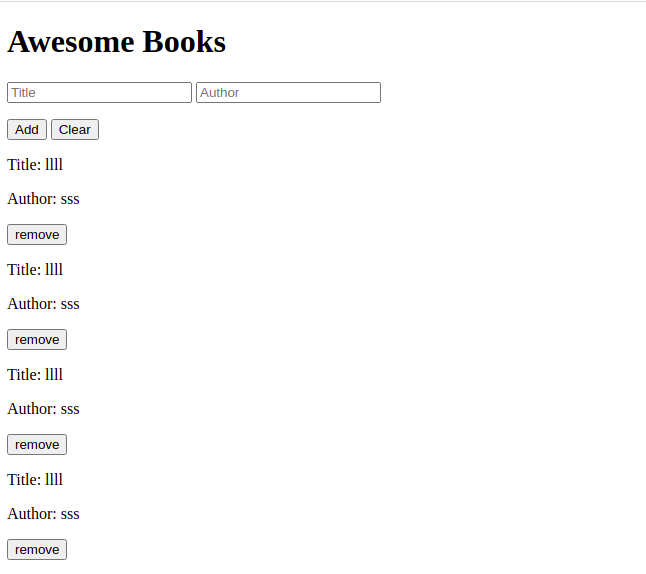

# Awesome_Books

> This project is a presentation of working with Javascript objects 

# Bot Preview

## Built With

- HTML
- CSS
- JAVASCRIPT

## Live Demo

[Live Demo Link](https://abdona.github.io/Awesome_Books/)

# Install Instruction
1. Open your terminal and `cd` to a proper location.
2. Clone the Repo on you computer using `git clone git@github.com:Abdona/Awesome_Books.git`
3. Make sure you have JavaScript installed; use `js -v` .
4. Cd to the project directory`cd Awesome_Books` .
5. Open `index.html`.

## Authors

👤 **Anass**

- Twitter: [@twitter](https://twitter.com/rockerbell)
- LinkedIn: [@LinkedIn](https://www.linkedin.com/in/anass-tantane/)
- GitHub: [@github](https://github.com/rockerbell)

👤 **Abdulrahman**

- GitHub: [@Abdona](https://github.com/Abdona)
- LinkedIn: [LinkedIn](https://www.linkedin.com/in/abdulrahman-nasser-2b7173131/)

## 🤝 Contributing

Contributions, issues, and feature requests are welcome!

Feel free to check the [issues page](issues/).

## Show your support

Give a ⭐️ if you like this project!

## Acknowledgments

- Hat tip to anyone whose code was used
- Inspiration
- etc

## 📝 License

This project is [MIT](lic.url) licensed.
